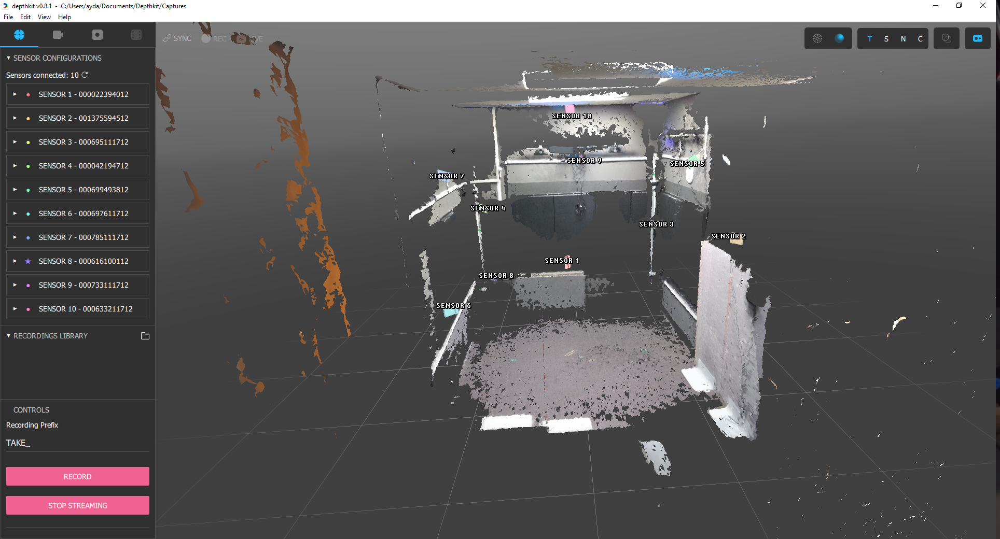
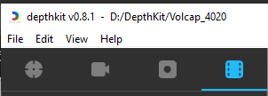
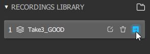

## Introduction
This guide will help you set up and record high-quality video using DepthKit.

## Setup DepthKit
1. Launch DepthKit:
   - Launch DepthKit on the computer.

2. Open Existing Project:
   - To use the existing calibration, double-click on the project folder located at "D:\DepthKit" named "Volcap_4020".
   - If you encounter any issues with the camera calibration, please refer to the [Calibration documentation](https://docs.depthkit.tv/docs/calibration) on recalibrating the cameras. If necessary, please create a new project for this purpose.

3. Position the Subject:
   - Place your subject at the center marking of the room.
   - Ensure that the subject avoids wearing black, white, glasses, or ripped clothes for the best texture output.
   - For optimal results, it's important to remain within the marked boundaries of the room throughout the entire recording session.

4. Record Audio:
   - [If you want to record audio, please click here.](reaper.md)

## Recording with DepthKit
1. Start Streaming:
   - When you are confident with your setup, click on the "Start Streaming" button under the Controls section of DepthKit.
   - You have the option to name your take under Recording Prefix.
   - Remember to use a visual and audible cue at the beginning of each take, such as clapping your hands, to help with the syncing process.
   

     
   

2. Begin Recording:
   - In DepthKit, hit the Record button; a Diagnostics panel will be displayed.
   

     

3. End Recording:
   - After finishing your recording session, click on the "End Recording" button.

4. Stop Streaming:
   - Click on the "Stop Streaming" button when you have finished recording.
   - Refer to this [link](https://docs.depthkit.tv/docs/studio-recording) for more information.

## Post-Recording in DepthKit
1. Access the Editor Tab:
   - Head to the "Editor" tab.
   

     

2. Drill into Sensors:
   - You can drill into each sensor by clicking the arrow next to the clip's name in the Library.
   

     

3. Export Multiperspective CPP Video:
   - To create an asset that can be quickly placed into the Unity project, you can export a Multiperspective CPP Video. To do this, click on "Multiperspective CPP Video" from the export drop-down menu.
   - Then, go to the location where the files were saved and copy the generated files from DepthKit.
   - For more information refer to this [link](https://docs.depthkit.tv/docs/exporting).

## Next Steps
- [Go to Git Bash](Gitbash.md) for further instructions.
