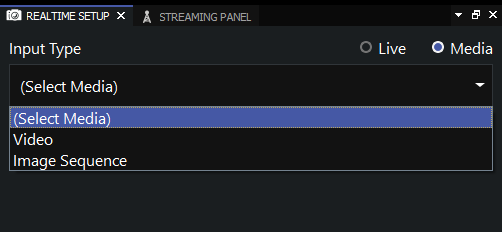
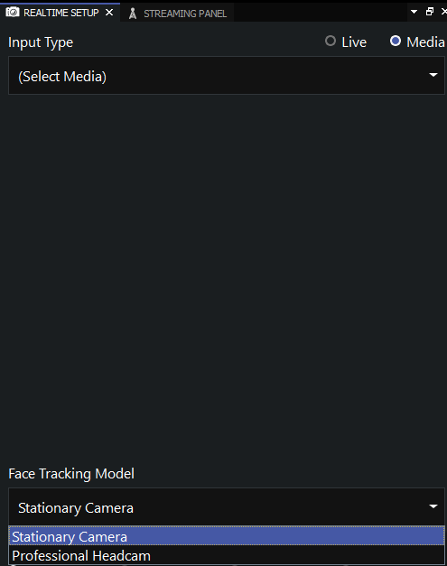
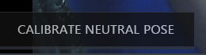
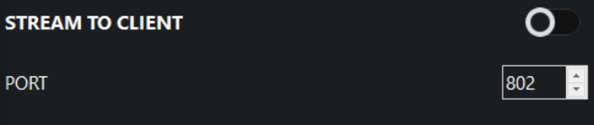

### Intro to Faceware Studio

Faceware Studio is software for tracking facial performance and animating a digital character in real-time. It's ideal for live events, on-set previsualization, and live online streaming with animated characters.

### Basic Workflow

1. *Launch FaceWare Studio*:
   - Note: The Pathfinder bar at the top of the Faceware Studio interface guides you through the workflow step-by-step and provides immediate feedback on the status of your work.
   - In the *Realtime Setup* panel, choose your video input:
     - *Live* for live video (headcam/webcam).
     - *Media* for prerecorded video or image sequence.
   

     
   

2. *Calibrate Your Actor*:
   - In Realtime Setup, select Face Tracking Model:
     - *Stationary Camera* or *Professional Headcam* based on your footage.
   

     

     

     - Calibrate Neutral Pose:
     - Have the actor look straight with a neutral expression.
     - Press "Calibrate Neutral Pose". Tracking landmarks will appear and the preview character will animate.
   

     
   

3. *Stream Animation Data*:
   - Open the Streaming Panel (View > Panels > Streaming Panel if closed).
   - Enter the port number matching your Live Client plugin.
   - Turn on *Stream to Client* to start streaming animation data.
   

     
   

  
4. Animation Tuning
5. Motion Effects
   - All Motion Effects are created, applied, and managed in the Motion Effects panel.
   - To apply one or more motion effects to your animation, [click here for more information.](http://support.facewaretech.com/studio-motion-effects$)
