# Faceware Live Link Plugin Using Unreal Engine

## Step 1: Enabling the Plugin

1. Open Unreal Engine.
2. Create a new Project.
3. Go to **Edit > Plugins**.
   

     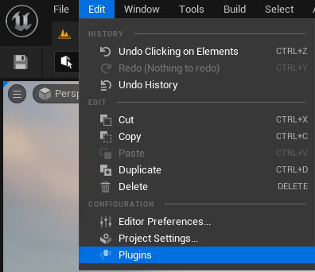
   

4. In the plugins window, select **Installed > Animation** and find *Faceware Live Link*.
   

     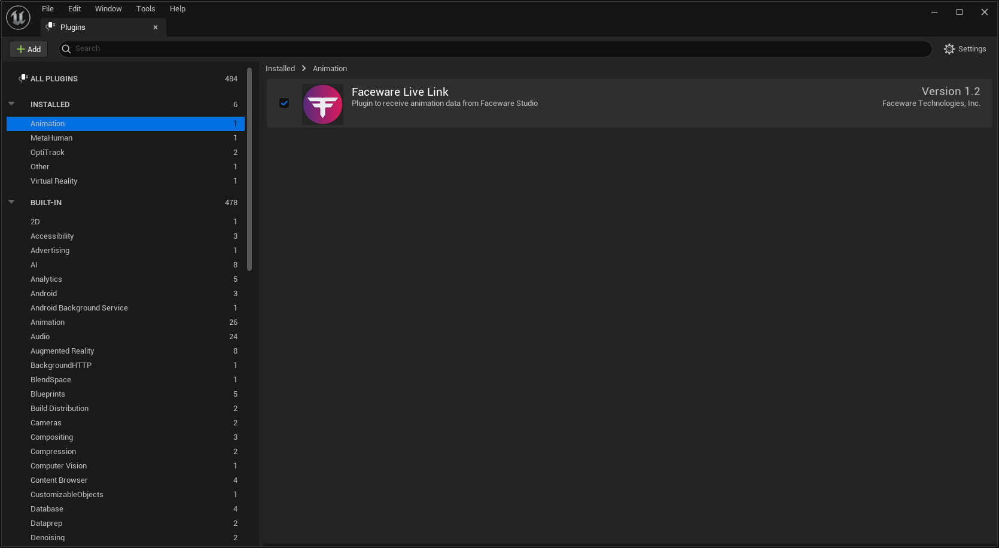
   

5. Enable the plugin and restart Unreal Engine if prompted.

## Step 2: Connecting to Faceware Studio

1. In Unreal Engine, open **Window > Virtual Production > Live Link**.
   

     
   

2. In the Live Link window, click **+Source** and select **Faceware Live Link**. Enter the IP address and port number to match your Faceware Studio input, and click OK.
   

     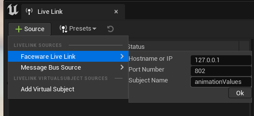
   

3. In Faceware Studio, set up your video stream and calibrate your video. Set the Control Schema to **Standard** and start streaming to the client.
   

     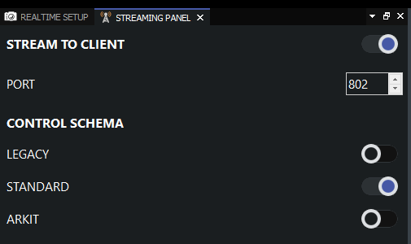
   

5. In Unreal, create a new animation blueprint: Right-click in **Content Browser > Animation > Animation Blueprint**. Select your skeleton and click OK.
   

     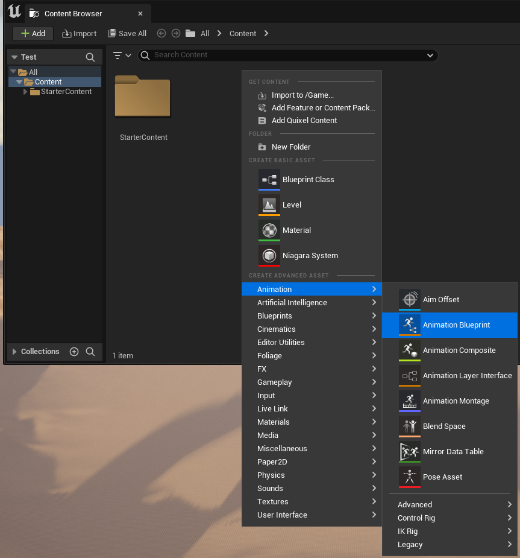
   

4. Double-click your new blueprint in the Content Browser to open the Event Graph.
5. In the **Event Graph**, from the *Update Animation* node, create and connect to *Evaluate Live Link Frame*.
6. Set *animationValues* in the *Subject* dropdown and make sure *FacewareLiveLinkRole* is in the *Role* dropdown.
   

     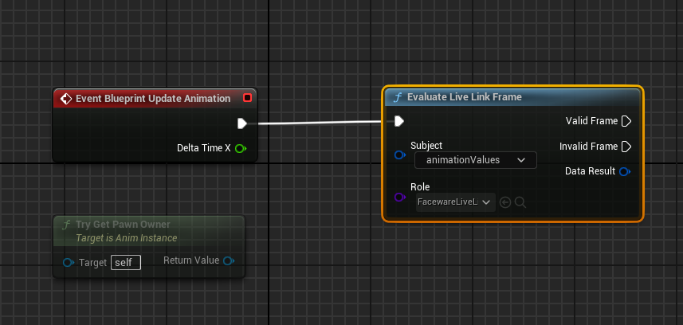
   

7. Drag from *Data Result* pin to create a *Break FTIAnimationBlueprintData* node.
   

     
   

8. Right click on *Animation Values*  on the new Break FTIAnimationBluePrintDate and select *Promote to Variable*.
   

     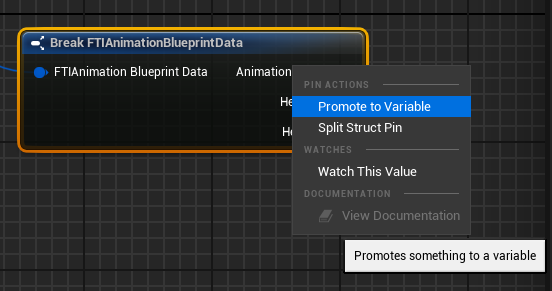
   

10. Connect the *Exec* pin from *Evaluate Live Link Frame* to the *Set* node.
   

     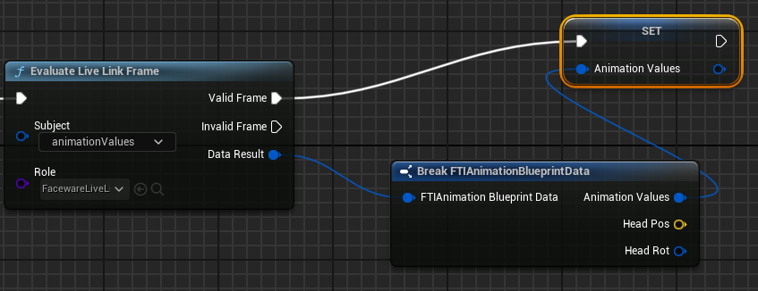
   

## Step 3: Character Control Setup

1. In the *My Blueprint* panel, drag *Animation Values* into the AnimGraph and select *Get Animation Variables*.
   

     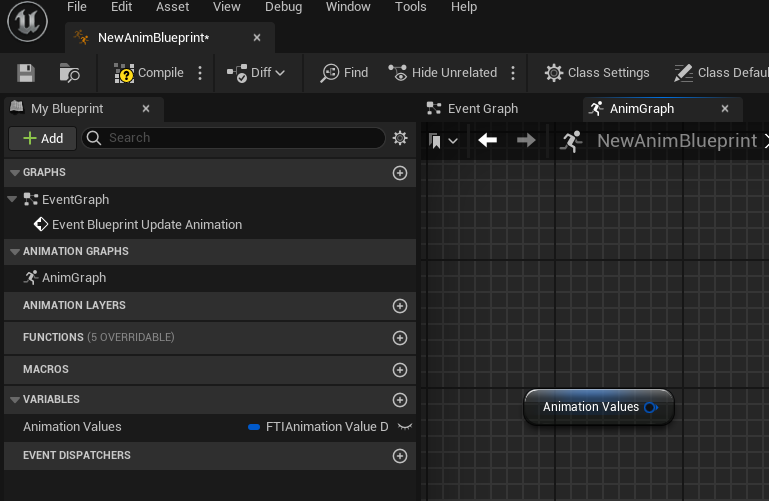
   

2. Drag the pin from *Animation Values* and create a *Break FTIAnimationValueData* node.
   

     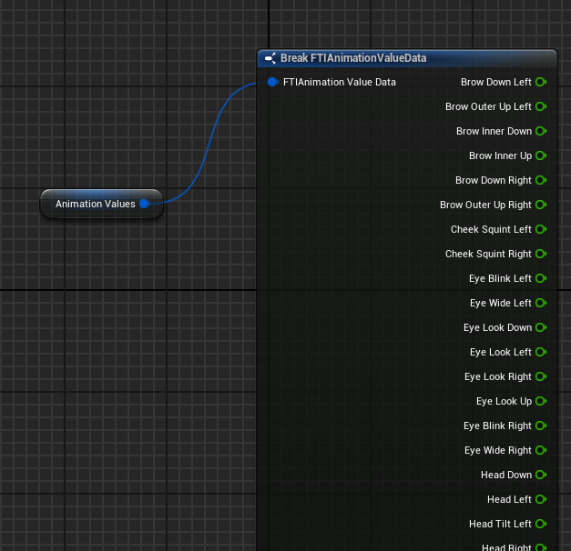
   

3. For each shape, drag out from the pin and create a *Modify Curve* node.
   

     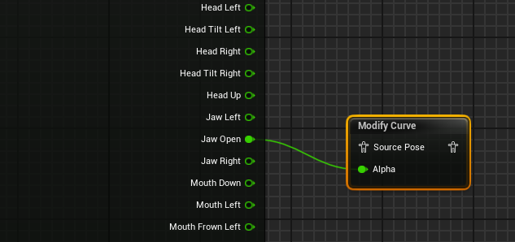
   

4. Right-click on *Modify Curve*, add a curve pin, and select the control to drive with animation data (JawOpen in this example).
5. Connect *Break FTIAnimationValueData* to the curve pin in *Modify Curve*.
6. Repeat steps 3-5 for each shape you are driving from the animation, connecting the animation pose output from each Modify Curve node to the input for the next one.
7. Connect the final *Modify Curve* node to the *Output Pose* node.
8. Play your scene to animate your character with Faceware Studio data
