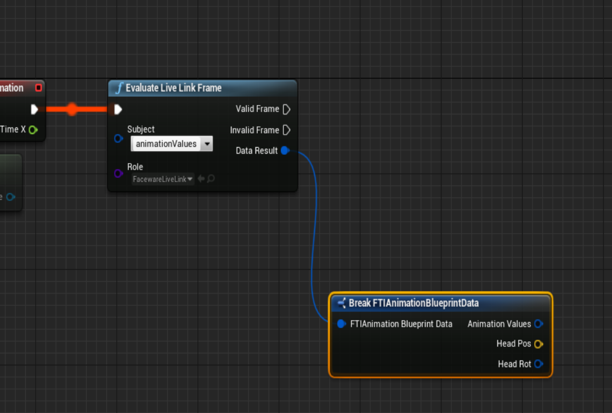

### Enabling the Plugin

1. Open Unreal Engine.
2. Go to `Edit > Plugins`.
   

     
   

4. In the plugins window, select `Installed > Animation` and find *Faceware Live Link*.
   

     
   

6. Enable the plugin and restart Unreal Engine if prompted.

### Connecting to Faceware Studio

1. In Unreal Engine, open `Window > Virtual Production > Live Link`.
   

     
   

2. In the Live Link window, click `+Source` and select `Faceware Live Link`. Enter the IP address and port number to match your Faceware Studio input, and click `OK`.
   

     
   

3. In Faceware Studio, [set up your video stream](http://support.facewaretech.com/realtime-setup) and [calibrate your video](http://support.facewaretech.com/studio-calibration). Set the [Control Schema to "Standard"](http://support.facewaretech.com/studio-stream) and [start streaming to the client](http://support.facewaretech.com/studio-stream).
5. In Unreal, create a new animation blueprint: Right-click in `Content Browser > Animation > Animation Blueprint`. Select your skeleton and click `OK`.
   

     
   

4. Double-click your new blueprint in the Content Browser to open the Event Graph.
5. In the Event Graph, from the *Update Animation* node, create and connect to *Evaluate Live Link Frame*.
   

     
   

6. Set *animationValues* in the *Subject* dropdown and make sure *FacewareLiveLinkRole* is in the *Role* dropdown.
   

     
   

7. Drag from *Data Result* pin to create a *Break FTIAnimationBlueprintData* node.
   

     
   

8. Right click on *Animation Values*  on the new Break FTIAnimationBluePrintDate and select *Promote to Variable*.
9. Connect the *Exec* pin from *Evaluate Live Link Frame* to the *Set* node.
   

     
   

### Character Control Setup

1. In the *My Blueprint* panel, drag *Animation Values* into the AnimGraph and select *Get Animation Variables*.
   

     
   

3. Drag the pin from *Animation Values* and create a *Break FTIAnimationValueData* node.
   

     
   

5. For each shape, drag out from the pin and create a *Modify Curve* node.
6. Right-click on *Modify Curve*, add a curve pin, and select the control to drive with animation data.
7. Connect *Break FTIAnimationValueData* to the curve pin in *Modify Curve*.
8. Connect the final *Modify Curve* node to the *Output Pose* node.
9. Play your scene to animate your character with Faceware Studio data
