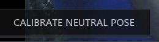

# Recording with Faceware Studio

## Introduction
This guide will help you set up and record high-quality video using Faceware Studio, and use the recorded data to animate a character.

## Step 1: Hardware Setup

1. [Click on this link to initiate the setup process for the necessary hardware for recording.](https://www.youtube.com/watch?v=kcALXTq6QIU)
2. Use the following image as a reference to get an overview of connections and components involved in the setup:
   

     

## Step 2: Record a Video Using Mark IV
1. *Launch Faceware Shepherd*:
   - Login using the username/password given on the key.
2. *Activate the Camera*:
   - Once all connections are established, power on the camera.
3. *Power Up the Teradek Bolt*:
   - Turn on the Teradek Bolt device.
4. *Begin Recording*:
   - If the Teradek Bolt displays "sending video" or if Faceware Shepherd shows "status ready", you're set to record.
   

     
   

   
## Step 3: Importing and Processing Video in Faceware Studio

Faceware Studio is software for tracking facial performance and animating a digital character in real-time. It's ideal for live events, on-set previsualization, and live online streaming with animated characters.

## Step 4: Basic Workflow

1. *Launch FaceWare Studio*:
   - Note: The Pathfinder bar at the top of the Faceware Studio interface guides you through the workflow step-by-step and provides immediate feedback on the status of your work.
   

     

     
     - In the *Realtime Setup* panel, choose your video input:
     - *Live* for live video (headcam/webcam).
     - *Media* for prerecorded video or image sequence.
   

     
   

2. *Calibrate Your Actor*:
   - In Realtime Setup, select Face Tracking Model:
     - *Stationary Camera* or *Professional Headcam* based on your footage.
   

     

     

     - Calibrate Neutral Pose:
     - Have the actor look straight with a neutral expression.
     - Press "Calibrate Neutral Pose". Tracking landmarks will appear and the preview character will animate.
   

     
   

3. *Stream Animation Data*:
   - Open the Streaming Panel (View > Panels > Streaming Panel if closed).
   - Enter the port number matching your Live Client plugin.
   - Turn on *Stream to Client* to start streaming animation data.
   

     
   

  
4. Animation Tuning
   - It allows users to fine-tune the data streaming from Studio to increase the control that they have over the final animation by letting the user change the output on a custom shape-by-shape basis.
   - [Click here for more information](http://support.facewaretech.com/studio-tuning$)
   

     
   

7. Motion Effects
   - To apply one or more motion effects to your animation, [click here for more information.](http://support.facewaretech.com/studio-motion-effects$)
   

     
   

   
## Next Steps
1. *Live Link Plugin*:
   - Faceware provides a live link plugin to seamlessly stream data from Faceware Studio into Unreal Engine. [Click here for more information](Unreal.md)

2. *Using MetaHuman*:
   - If you opt to use MetaHuman instead of a custom character, [click here.](metaHuman.md)
