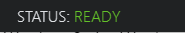

# Mark IV Headcam setup & Faceware Shepherd

## Introduction
This guide will help you set up and record high-quality video using Faceware Shepherd, and use the recorded data to animate a character.

## Step 1: Hardware Setup

1. [Click on this link to initiate the setup process for the necessary hardware for recording.](https://www.youtube.com/watch?v=kcALXTq6QIU)
2. Use the following images as a reference to get an overview of connections and components involved in the setup:
   

     

   

     

## Step 2: Record a Video Using Mark IV
1. *Launch Faceware Shepherd*:
   - Login using the username/password given on the key.
2. *Activate the Camera*:
   - Once all connections are established, turn on the camera.
3. *Power Up the Teradek Bolt*:
   - Turn on the Teradek Bolt device.
4. *Begin Recording*:
   - If the Teradek Bolt shows "sending video", you have two options: you can either record a video first and then import it to work with, or you can work live with the media while being on camera.
   

     
   

   
### Shepherd Recording

#### 1. Connect to Networked Ki Pro Devices
1. Click on the `Add Ki Pro Device` button.
   

     

     
2. Select `Add All Ki Pros on Your Network`.
   

     

     
3. The device list will populate with all available devices.

     
#### 2. Start Recording on Ki Pro(s) from Shepherd Interface
1. To begin recording, arm the Ki Pro by sliding the toggle on the right of the Device List (green = armed).
   

     

     
2. Enter a clip name and a take number in the fields at the top left (take numbers auto-increment).
   

     

     
3. Once armed and named, the Record transport control will become active and Status will show `Ready`.
   

     

     
   

     

     
4. Press Record to start and Stop to end. The playlist updates with the new clip and increments the take number.

5. After recording, go to the panel on the left. Right-click the desired take and select Transfer Selected Clip to save the video.
   

     

## Next Steps
- [Faceware Studio Guide](faceWareStudio.md) 
