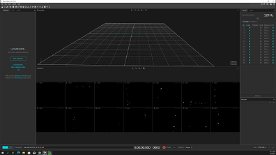
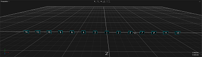
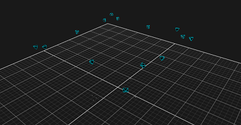
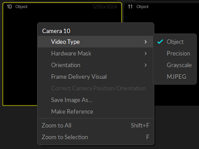
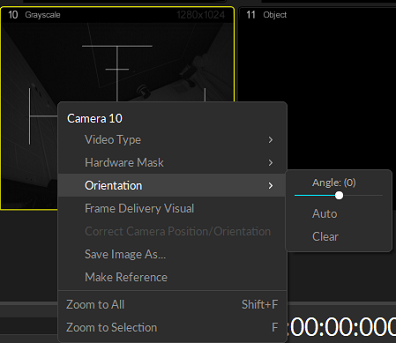

# Motive and Unreal Setup Guide

## Introduction
This guide will help you set up and integrate Motive and Unreal Engine for motion capture and animation projects.

## Step 1: Launch Motive.
   - Upon launch, you may notice all cameras in a straight line, indicating they are not calibrated.
      

     

     

     

## Step 2: Calibrate the Cameras:
   - For a thorough explanation on how to calibrate the cameras, watch this video. [Optitrack Calibration](https://drive.google.com/file/d/1HZ_CApepS6SpNlUBTgoetyYuwgrFyXnU/view)

Calibrate the cameras in the following situations:
   - After a system restart
   - When blue rings on the cameras turn off (indicating disconnection)
   - Following any modifications to the truss setup
   - If you sense irregularities in camera performance

Here’s a visual of the post-calibrated cameras.
   

     

## Step 3: Camera Orientation
After calibration, orient the cameras:
   - *Switch to Grayscale Mode:* Right-click on each camera in Motive one at a time and change the mode to Grayscale for a clearer view.
   

     

   - *Adjust Orientation:* Right-click again and select "Orientation" to adjust the camera angles, ideally in 90-degree increments. Note that Motive allows adjustments in 5-degree increments.
   

     

     
   - *Return to Object Mode:* Once oriented, switch the cameras back to Object mode.
     
  

## Step 4: Create Rigid Body Skeleton
1. *Prepare the Actor:*
   - Attach markers at appropriate anatomical points on the actor. Have the actor stand in the volume in a T-pose.
   

     

     
   - In Motive, go to *Layout > Create* and select Skeleton from the Builder pane.
   

     

     

2. *Define Marker Set:*
   - Ensure markers are placed correctly by verifying the model in the Builder pane against the actor's markers.
   - Verify that 57 markers have been detected; 57 markers are required.
   

     

     

3. *Create Skeleton:*
   - With the actor in T-pose, select all 57 markers in the Perspective view.
   

     

     
   - Click the Create button in the Builder pane.
   

     

     
   - Rename the rigid body for easy identification.
   - The properties panel will display information such as the rigid body's center of rotation and orientation axes.
   

     

     

## Step 5: Recording and Exporting Data
1. *Recording:* 
     - Press the red record button or spacebar in Live mode to begin capturing data. It's advisable to start and end with a T-pose for easy post-processing.
   

     

     

2. *Post-Capture:*
     - Review the capture, edit marker data as necessary using the Edit Tools pane, and ensure markers are properly labeled.
     - Export the data in various formats such as FBX, BVH, or CSV through *File > Export Tracking Data*.
   

     

### Useful links:  
Check out the links below for more information:
  - [Motive Guide] (https://docs.optitrack.com/quick-start-guides/quick-start-guide-getting-started)
  - [Rigid Body Skeleton](https://drive.google.com/drive/folders/1o1ylpUgmxOkTpjF2N5syR45N1CYYgru5)
  - [Rigid Body](https://drive.google.com/drive/folders/1o1ylpUgmxOkTpjF2N5syR45N1CYYgru5)

## Next Step:
- [Unreal Guide](unreal.md)
