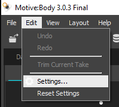
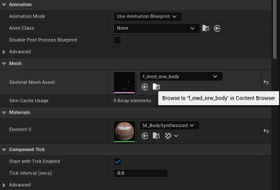

# Motive and MetaHumans Setup Guide

## Introduction
This guide provides a step-by-step process to integrate the data with Unreal Engine for MetaHumans animation using Motive.

## Step 1: Motive Setting:

1. Once you are done setting up Motive, the Rigid Body, and calibrating the cameras: 
2. *Configure Streaming Settings:*
   - Navigate to Edit > Settings > Streaming.
   

     

     

   - Change the “Local Interface” setting to the IP address beginning with “198.82.19”.
   

     

## Step 2: Integrating with Unreal Engine

1. *Open Unreal Engine:*
   - Start Unreal Engine and open a new MetaHuman Project.

2. *Enable Plugins:*
   - Go to Edit > Plugins.
   

     

     
   - Ensure that both “OptiTrack - Live Link” and “OptiTrack - Streaming Client” plugins are enabled.
   

     

     
   - Restart Unreal Engine if prompted.

3. *Setup LiveLink Source:*
   - Go to Window > Virtual Production > Live Link to open the Live Link window.
   

     

     
   - Click the + Source button and select OptiTrack Source.
   - Click on Create.
   

     

     

4. *Verify Connection:*
   - Once connected, you should see assets from Motive appearing in Unreal Engine’s Live Link view, indicated by green circles.

## Step 3: Setting Up MetaHumans

1. *Create Animation Blueprint:*
   - Create an Animation Blueprint named ABP_(name of MetaHuman).
 

     

     
   - Set the skeleton to metahuman_base_skel and the parent class to OptiTrackAnimInstance.
   - Click on Create.
 

     

2. *Configure Animation Blueprint:*
   - Double click on ABP_(name). If the AnimGraph isn’t visible, open it.
   - Add a LiveLinkPose node and connect it to the output pose node.
 

     

 

     

   - Select the LiveLinkPose node and change the retarget asset to OptiTrackLiveLinkRetarget.
 

     

     
   - Compile and save the Blueprint.

3. *Adjust MetaHuman Settings:*
   - In the Content Browser, locate the MetaHumans folder and find your MetaHuman.
   - Open the BP_(name) file.
   - Click on LODSync in the components window and set Forced LOD to 0.

 

     

     
   - Select the body component and under the details panel, navigate to mesh/skeletal mesh asset.
 

     

     
   - Set the Post Processing Anim Blueprint to the ABP_(name) created earlier.
 

     

   - Drag and drop the main MetaHuman BP_(name) asset into your level and.
   - To test if it worked is if the MetaHuman stands in the Motive default T-Pose instead of the MetaHuman default A-Pose.
 

     

  
### Useful links:  
Check out the video below for more information:
  - [Unreal Engine](https://drive.google.com/drive/folders/1o1ylpUgmxOkTpjF2N5syR45N1CYYgru5)
