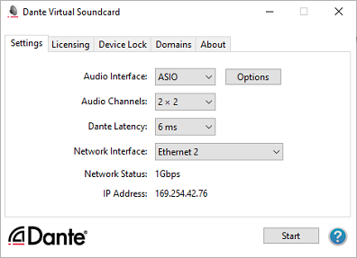
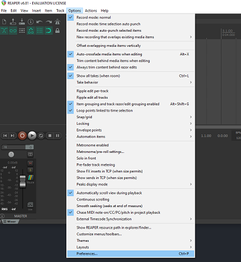
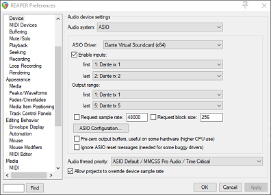
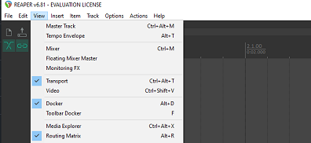
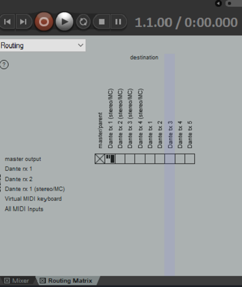
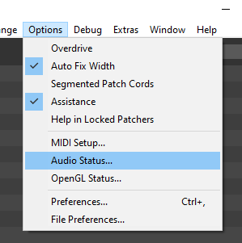
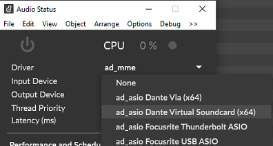
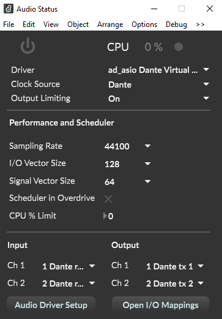

# Spatial Audio (Multichannel) Guide

## *Introduction*
To create spatial audio experiences, specific software must be utilized that allows for multichannel routing and ambisonic playback.

### Note: Please be sure to check your levels before outputting audio from the computer. It is best to start with the sound off completely to avoid blasting your ears. Slowly increase the sound level.

## Step 1: Setup Dante Virtual Soundcard:  
1. Open Dante Virtual Soundcard and switch to "ASIO" interface.
   - If "WDM" is selected, press "Stop" at the bottom right of the window and change the interface to "ASIO" as shown here and press "Start".
   

     
   

   
   -  ASIO is used in pro-audio software, and will allow for multichannel routing.
 
  
## Step 2: Choose the Software:
### a. Reaper: is for multichannel audio routing, mixing, and basic audio effects.

1. *Launch Reaper*  
   - Import the sample Reaper template provided.  (where)

2. *Configure Output Device*  
   - Go to Options > Preferences.
   

     
   

   
   - Set output range to Dante tx 1 to Dante tx 5 and sample rate to 48000 Hz.
   - Ensure that the settings match the ones shown in the picture below. 
   - Click "Apply" and "OK".
   

     
   

   

3. *Routing Matrix*  
   - Go to View > Routing Matrix to access the "Routing Matrix" tab .
   

     
   

   
   -  Use the routing matrix to direct where audio from specific tracks are output.
     

     
   

   

### b. MaxMSP: is for custom audio processing, interactive sound installations, and advanced audio effects not easily achieved in a DAW.
1. *Launch MaxMSP*  
   - Open the sample MaxMSP patch provided. (where)

2. *Configure Output Device*  
   - Go to “Options” > “Audio Status”.
     

     
   

   
   - Select "ad_asio Dante Virtual Soundcard (x64)" as the driver.
     

     
   

   
   - Use “Open I/O Mapping” for routing configuration.
     

     
   

   
   - Close the Audio Status window and begin patching.

[Click here to learn more about MaxMSP](https://cycling74.com/tutorials?page=1)
