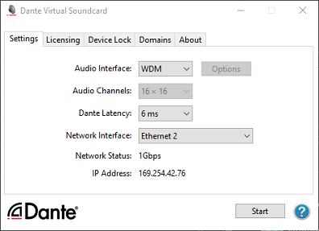
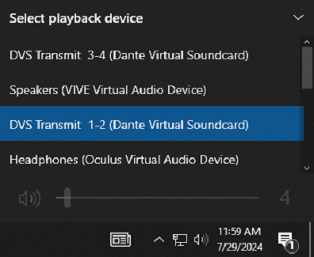
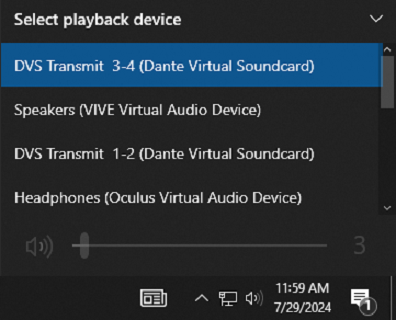
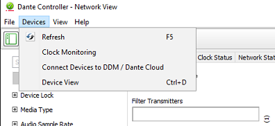
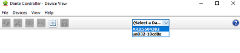
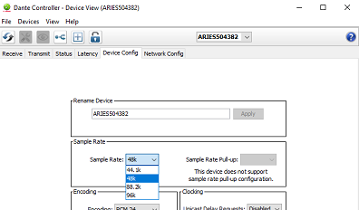
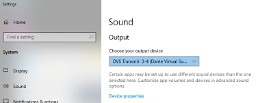
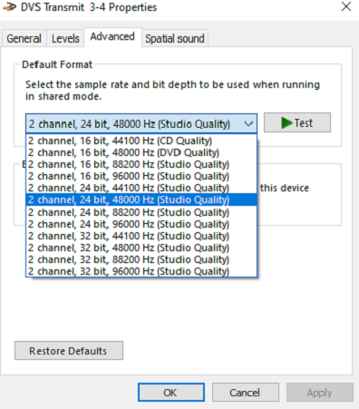

# Computer Audio (Stereo) Guide

## *Introduction*
It may be desired to output audio from the computer as a typical stereo format. Audio from youtube and other web-based applications, as well as desktop software and games, can be routed through the speakers in this way.

### Note: Please be sure to check your levels before outputting audio from the computer. It is best to start with the sound off completely to avoid blasting your ears. Slowly increase the sound level.

## Step 1: Setup Dante Virtual Soundcard: 
1. Open Dante Virtual Soundcard and set the audio interface to "WDM".
   - If "ASIO" is selected, press "Stop" at the bottom right of the window and change the interface to "WDM" as shown here and press "Start".
   

     
   

  
 ## Step 2: Desktop Applications (YouTube, Music Players, Adobe Software, Unity, Etc.)
1. Adjust settings to route stereo output:
   - Select Dante tx (transmit) 1-2 or Dante tx (transmit) 3-4 from the speaker icon in the system tray. Remember: start with the volume low.
   

     
   

   

     
   

   - If audio playback is not occuring, check sample rate settings across all devices:  
     - Open Dante Controller, select Devices -> Device View.
   

     
   

     - Use the drop down menu to select the different devices.
   

     
   

     - Select the "Device Config" Tab
     - Ensure that the sample rate is 48 kHz for both the und32-10cd8a and the aries400733 devices.
   

     
   

     - Open up the sound settings via the Windows search bar.
     - Select "Device Properties".
   

     
   

     - Select "Additional device properties".
   

     
   

     - Choose the "Advanced" tab.
     - Use the drop-down menu to select "2-channel, 24 bit, 48000 Hz".
     - Hit "Apply" and then "OK".
   

     
   

