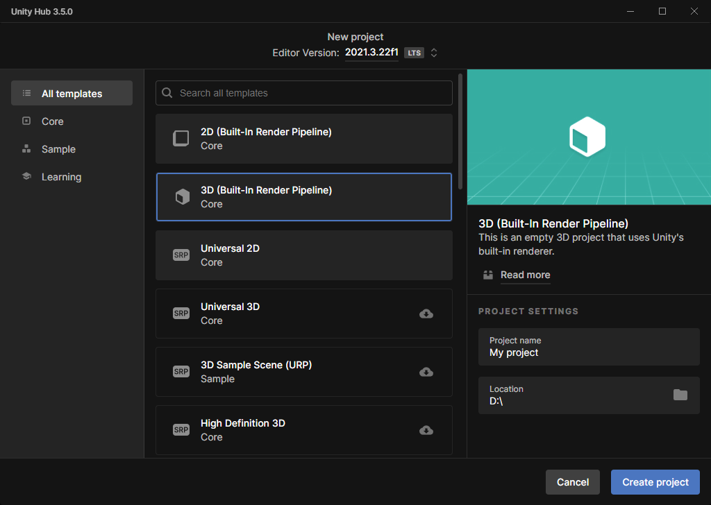
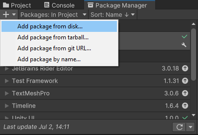
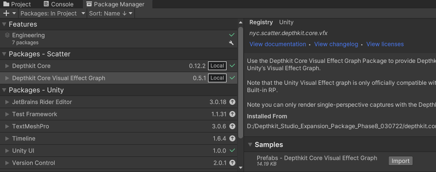
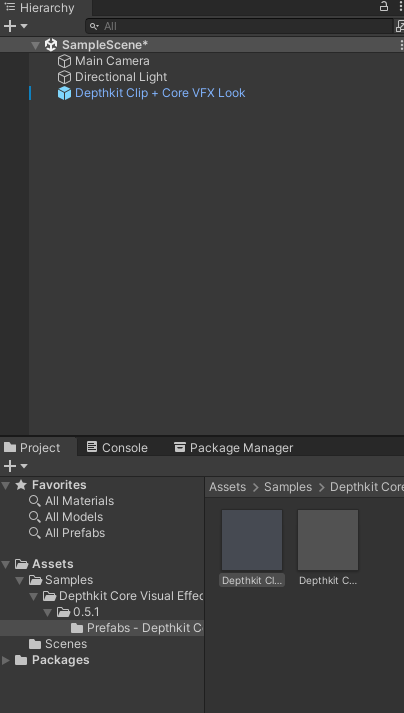
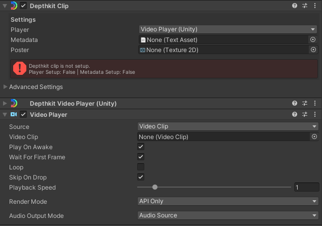
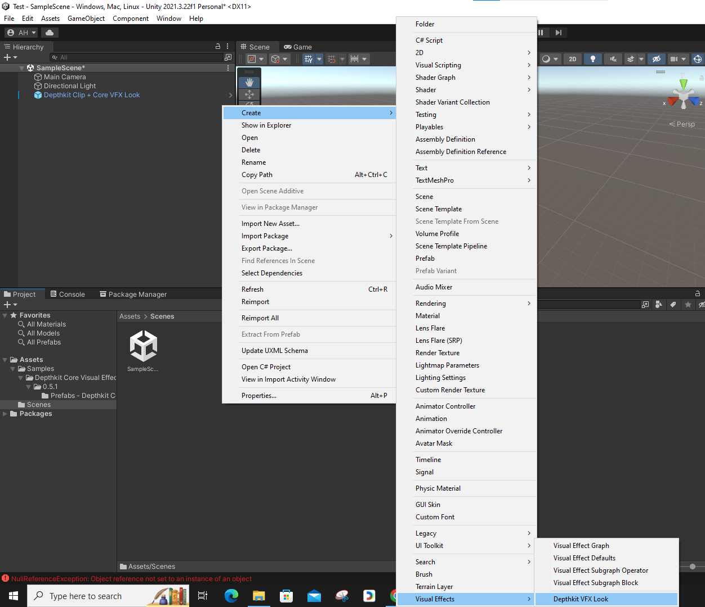

### Creating Visual Effects with Depth Kit and Visual Effect Graph

#### Step 1: Create a New Project via Unity Hub

1. Open Unity Hub and create a new project using the 3D template.

     

#### Step 2: Install Depth Kit Packages

1. *Install VFX Graph Package*:
   - In Unity, navigate to `Window > Package Manager`.
   - Click the + icon and select Add package from disk....

   - Locate the Depth Kit Core package folder.
   - Select package.json file located in `D:\Depthkit_Studio_Expansion_Package_Phase8_030722\depthkit.core` and click Open.

2. *Install Depth Kit VFX Package*:
   - Repeat the previous step for the Depth Kit Core VFX package located in `D:\Depthkit_Studio_Expansion_Package_Phase8_030722\depthkit.core.vfx`.

#### Step 3: Import Depth Kit Assets

1. *Import Depth Kit Core VFX Prefab*:
   - In the Package Manager, find and expand Depth Kit Core VFX Graph.
   - Toggle to import the Depth Kit Core VFX Prefab, which includes an example VFX setup.

     

2. *Drag Prefab to Scene*:
   - In the Project window under Assets, locate the imported prefab under Samples.
   - Select Depth Kit Clip Plus Core VFX prefab and drag it into your scene hierarchy.

     

#### Step 4: Set Up Depth Kit Video Files

1. *Create Clips Folder*:
   - In the Project window, right-click in the Assets folder and create a new folder named Clips.

2. *Import Video Files*:
   - Drag your Depth Kit video assets into the Clips folder.
   - Also, drag any associated metadata text files and optional poster images into this folder.

#### Step 5: Configure Depth Kit Clip

1. *Set Up Video Clip*:
   - Select the Depth Kit clip in the hierarchy.
   - In the Inspector, under the Video Player component, drag your video file into the Video Clip field.

2. *Add Metadata and Poster Image*:
   - Drag your metadata and poster image over to the respective fields under the Clip component within the Inspector.

     

     
#### Step 6: Customize Visual Effects with VFX Graph (Optional)

1. *Create Custom VFX Look*:
   - Right-click in the Project tab and select Create > Visual Effects > Depth Kit VFX Look.
   - This creates a new VFX Look file (e.g., "My VFX Look") for you to customize.

     

2. *Edit in VFX Graph*:
   - Double-click the newly created VFX Look file to open the VFX Graph workspace.
   - Use the node graph to design your custom visual effect for the Depth Kit clip.

#### Step 7: Apply Custom VFX Look

1. *Apply Custom Look to Clip*:
   - Select the Depth Kit Clip in the hierarchy.
   - In the Inspector, navigate to the Visual Effect component.
   - Update the Asset Template field to replace the Depth Kit VFX example look with your custom VFX look.

#### Step 8: Final Adjustments and Tweaks

1. *Refine Your Custom Look*:
   - Continue tweaking and refining your custom VFX look directly within the VFX Graph workspace.
