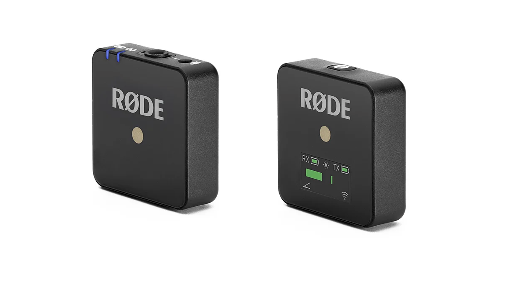
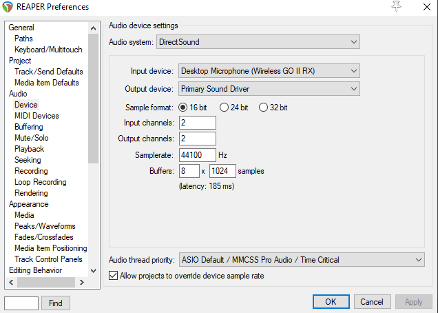
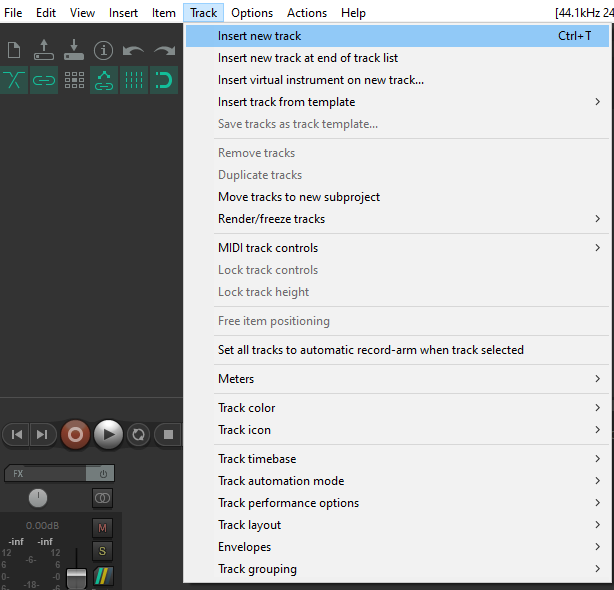
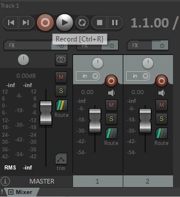
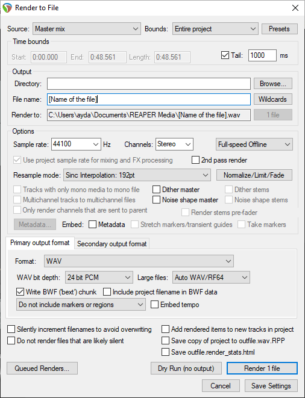

# Recording Audio with Reaper

## Introduction
This guide will help you set up and record high-quality audio using the Rode Wireless GO II system with Reaper.

## Setup the Rode Wireless GO II
1. **Pair the Units**:
   - Utilize the Rode Wireless GO II microphones stored in the box labeled "VolCap Audio."

     

     
2. **Pair the Units**:
   - Turn on both units and pair them.
3. **Connect the receiver to Computer**:
   - Use the USB-A to USB-C cable.

## Configure Audio Settings in Reaper
1. **Open Reaper**:
   - Launch Reaper on the computer.
2. **Set Up Audio Device**:
   - Go to `Options > Preferences`.
   - Select `Audio > Device`.
   - Set the `Audio system` to `DirectSound`
   - Select the Rode Wireless GO II as your `Input device`.

     

     
3. **Create a New Track**:
   - Create a new track in your Digital Audio Workstation by going to the Track menu option.
       

     
   

## Recording Audio with Reaper
1. **Start Recording**:
   - Making sure that the track record is armed.
   - Click the `Record` button to start recording.

     

     
2. **Stop Recording**:
   - Click the `Stop` button to stop recording and save the audio.

## Exporting Audio
1. **Export as WAV or MP3**:
   - Go to `File > Render`.
   - Name the recording.
   - Choose the desired `Output format`.
   - Click `Render 1 file`.

     

     

### Useful Links
- [Reaper User Guide](https://www.reaper.fm/userguide.php)
- [Rode Wireless GO II User Guide](https://rode.com/en/user-guides/wirelessgoii)

