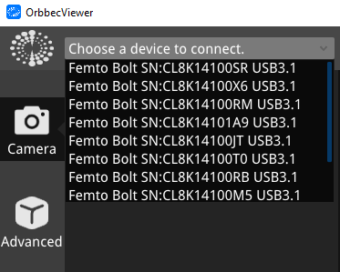
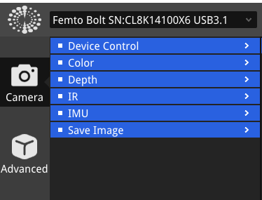

### Orbbec Viewer Guide

*Connecting and Viewing Device Information:*

1. *Connection Status:*
   - Open the Orbbec Viewer software to confirm the cameras are streaming.
2. *Device Details:*
   - Use the dropdown menu on the left side to access device information.

     

*Camera Control:*

Access these options either from the tab at the top:

     

Or from the Camera button to the left:

     

1. *Depth Features:*
   - View the colorized depth data representation.

2. *Color Features:*
   - Control the exposure, brightness, sharpness, and other settings of the camera.

3. *IMU (Inertial Measurement Unit):*
   - Correct IMU data and calibrate the gyroscope.

*Save Image:*

- Store depth, RGB, and IR data via the screenshot button or the "Image Save" tab.

*Stream Preview Window Controls:*

- Use buttons for maximizing/minimizing, showing/hiding metadata, pausing/starting streams, capturing snapshots, adjusting preview size, and stopping streams.

---

Next step: [Go to DepthKit](Depthkit.md)
